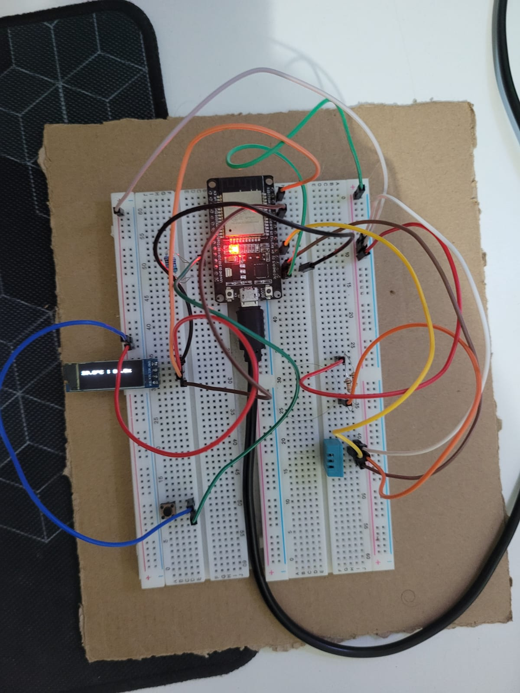
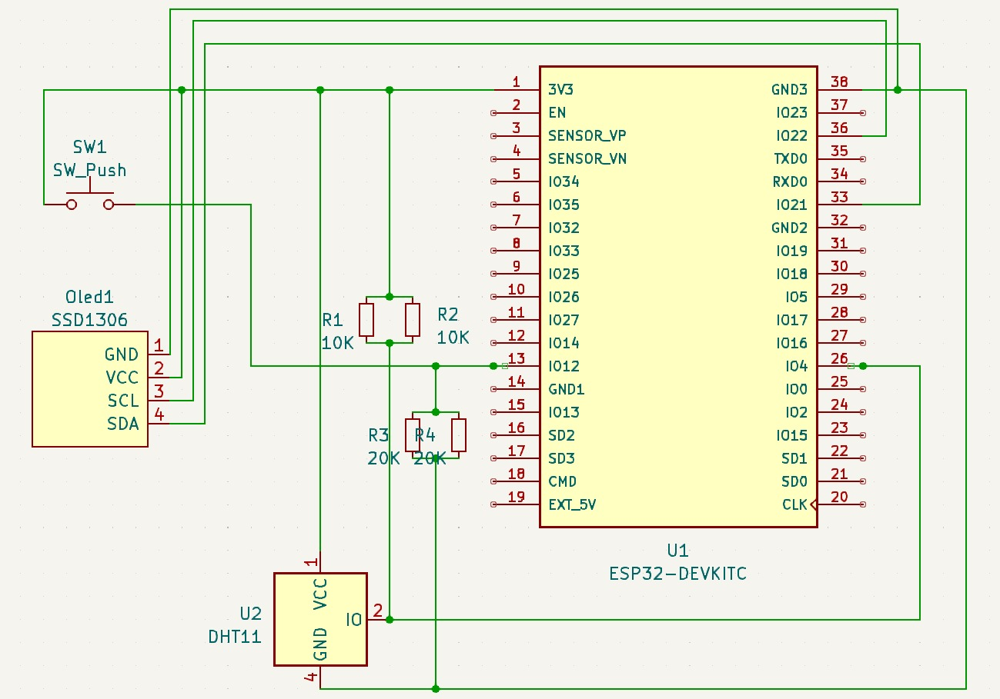

# Simple Weather Station

In this project, we show a simple Weather Application, using ESP32 and OLED. A simple OLed display shows the current temperature and the humidity using the DHT11 sensro and an attached button works as the user interaction of the application.

1. Button Click: Change temperature representation
1. Button Clicks: Show Simple Animation
1. Button Clicks: Turn monitor off/on

## Button

To implement button `on_click` the GPIO_INTR_POSEDGE was used to interrupt on up edge of the click, as wrote in `lib/button/button.c`. In the hardware, we have a `Push Button` with 10K pull down resistor (Using 2 20K parallel), so when the button is pressed, the MCU gets a HIGH voltage.
The `Main` application polls the button to see if the flag was changed in order to debounce it and call the `on_click` function.

## Animation

The animation is implemented using "tick". Every call by the main proccess updates the animation accordingly to the current time. This could be used to update an 2D Physics engine and use sprites to update the display.

## Main and Aplication Flow

The main file controls the application flow. We have 2 "Threads": The `main` thread polls button values, ticks the animation and show DHT11 informations in
the OLed Screen; The `weather` Thread, runs at every 500ms reading from DHT11 hardware and assign the values to a common variable, so the `main` thread can read it and show in the display.

## Circuit Diagram

    

        
Harware Circuit

        
    

    

        
Schematic Circuit

        
    

## 1 Click - Change Representation

    
The Temperature representations is changing between °C, °F and K.

    

## 2 Clicks - Show Animation (Changes application behaviour)

    
Every 2 Clicks the ball animations is shown.

    

## 3 Clicks - Turns the OLed display off (Power saver)

    
On 3 Clicks the screen is turn off to save battery life, turning on again when pressed three times.

    

## Documents about interrupt in ESP32
 - https://circuitdigest.com/microcontroller-projects/esp32-timers-and-timer-interrupts
 - https://docs.espressif.com/projects/esp-idf/en/v4.3/esp32/api-reference/peripherals/timer.html#timer-api-timer-initialization

## References

1. SSD1306 datasheet, can be found [here](https://www.alldatasheet.com/view.jsp?Searchword=Ssd1306%20datasheet&gad=1&gclid=Cj0KCQjw0tKiBhC6ARIsAAOXutlKWRNAzstZ96tXT6xcJW5a0YPrZwLqGcYIT_aOV5m33F_SBqrCLvEaAmuXEALw_wcB).
1. ESP-IDF Implementation of SSD1306 by `nopnop2002`, can be found [here](https://github.com/nopnop2002/esp-idf-ssd1306).
1. DHT11 Datasheet can be found [here](https://www.alldatasheet.com/view.jsp?Searchword=Dht11%20datasheet&gad=1&gclid=Cj0KCQjw9deiBhC1ARIsAHLjR2AGMjLPtpIg5_IqeDmJ1VmYxvTDiGTHjKHhD6Tg9kuFvFfot_n41hsaAssLEALw_wcB).
1. DHT11 Driver implementation by `UncleRus`, can be found [here](https://github.com/UncleRus/esp-idf-lib/tree/master/components/dht).